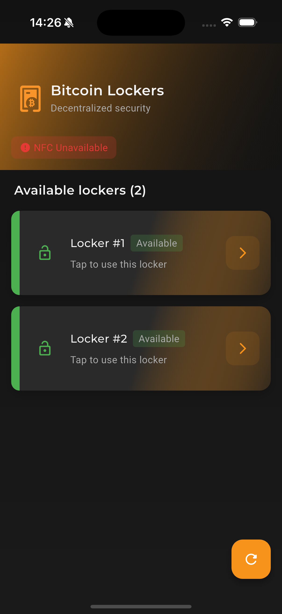
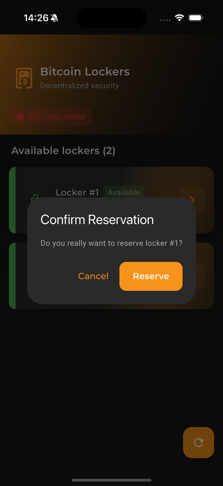
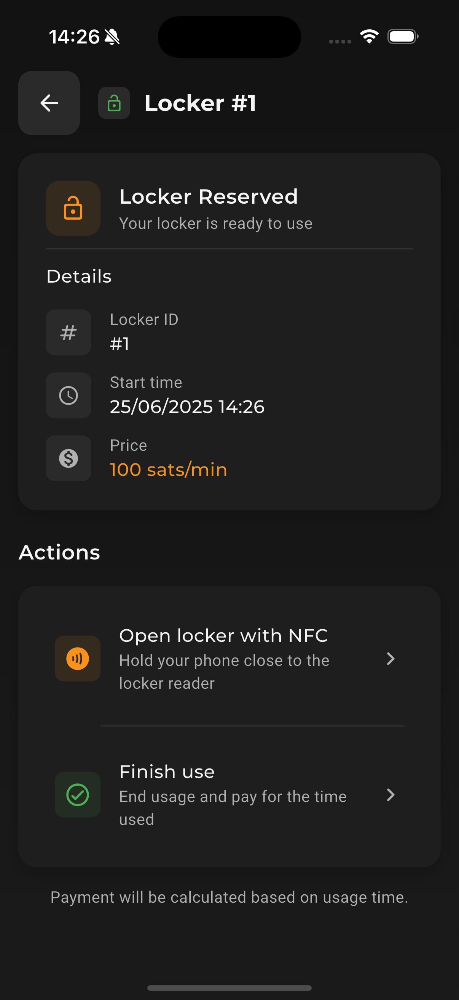
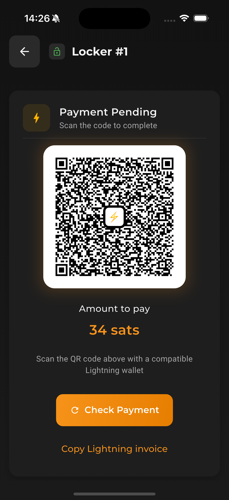

# Bitcoin Lockers  

  

## 📌 About the Project

**Bitcoin Lockers** is a modern application that allows users to **reserve physical lockers** and **pay for their usage via the Bitcoin Lightning Network (LN)**. Developed using **Flutter**, it delivers a smooth and responsive interface.

The app integrates seamlessly with a **Rust-powered backend API**, responsible for managing locker availability, payment requests, and real-time status updates.

Focused on **innovation**, **usability**, and **secure payments**, Bitcoin Lockers showcases how **decentralized technologies** like Lightning can be embedded into everyday physical infrastructure.

## 📸 Screenshots  

### 🌙 Dark Mode  

<table>
  <tr>
    <td>Home</td>
    <td>Confirm Reservation</td>
    <td>Reservation</td>
  </tr>
  <tr>
    <td></td>
    <td></td>
    <td></td>
  </tr>
  <tr>
    <td>Payment</td>
  </tr>
  <tr>
    <td></td>
  </tr>
</table>

## 📦 Installation and Usage

To get started, make sure the following services are running:

1. **Rust Backend API** – Start the backend server built with Rust.
2. **Phonenid LN Server** – Ensure the Lightning Network (LN) server (Phonenid) is running.

## Note
⚠️ This project was built as part of a **hackathon** and represents an early-stage **MVP (Minimum Viable Product)**.  
Some components are **mocked** or **simulated** to demonstrate the intended experience and flow of the final product.  
However, **Lightning Network (LN) payments are fully functional** and not mocked.

---

🚀 **Developed by [Cristian Solutchak](https://github.com/cristiansolutchak)**  

---